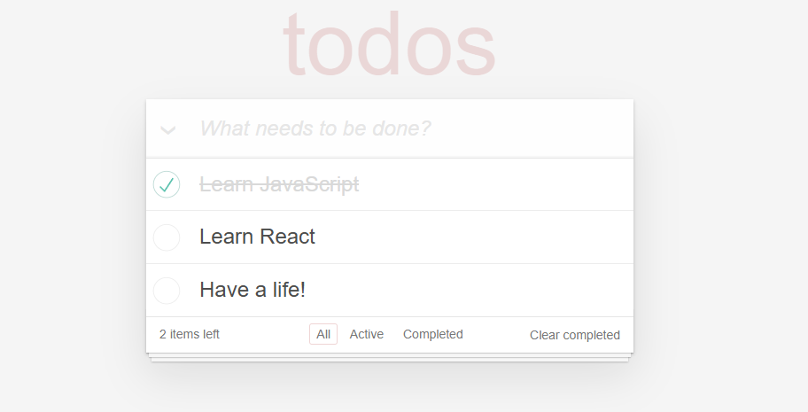

# To Do App project

**Website url**: [Demo](https://nejitodoapp.netlify.app/)

## Features
- **React**: The project leverages React for dynamic UI.




## Installation
1. Clone the repository
```
git clone https://github.com/onuryilmaze/todoapp.git
```
2. Navigate to the project folder
```
cd to-do-app
```
3. Install dependencies
```
npm install
```
4. Start the development server
```
npm run dev
```

## Technologies Used

- **React**: A JavaScript library for building user interfaces.
- **JavaScript (ES6+)**: Used for functionality such as state management and event handling.
- **HTML5 & CSS3**: For structuring and styling the project.
- **GitHub**: Version control for project management.